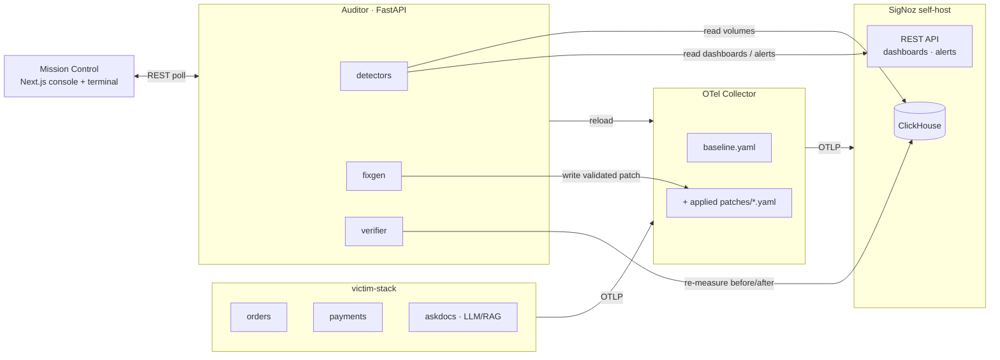

<div align="center">

<h1>SpanSaver&nbsp;🔎💸</h1>

### Stop paying for telemetry and tokens nobody reads.

SpanSaver is an **AI auditor for the two bills every engineering team overpays** —
observability ingestion and LLM tokens. It finds the leaks, **proves** they're safe to fix,
applies the fix, and **verifies** the savings against live SigNoz data.

<br/>


<em>Built for <strong>Agents of SigNoz</strong> — WeMakeDevs × SigNoz, July 2026 · Track 01</em>

</div>

<!-- DEMO GIF: apply → ingestion drops → green "verified, nothing broke" banner -->

---

## Why

Every observability bill and every LLM bill carries the same quiet tax: **data nobody looks at.**
Debug logs shipped from a hot path. Metrics someone added "temporarily" two quarters ago.
Health-check spans that outnumber real traffic. The same FAQ prompt answered fresh a thousand
times. It's invisible on the invoice — until someone measures it.

SpanSaver measures it, and — crucially — **proves a fix is safe before touching anything.** A
drop is only offered when *zero* dashboards and *zero* alerts depend on the data. That safety
proof, and the after-the-fact verification, are the product. Not the detection.

---

## Highlights

- 📉 **Real measurement, not guesses** — every number is a ClickHouse / SigNoz query. The LLM
  writes fixes, never facts.
- 🛡️ **"Referenced by: none"** — each drop is cross-checked against every dashboard and alert
  before it's allowed. No proof → recommend-only, stated plainly.
- 🧾 **Evidence on every finding** — measured volume, a 30-day cost projection, a deep-link into
  SigNoz, and the exact query that found it.
- 🔧 **Fixes are files** — scoped, reviewable OTel Collector patches. Never a runtime edit to the
  baseline; always reversible.
- ✅ **Verify or it didn't happen** — before/after volume plus an integrity sweep confirming
  nothing you rely on broke.
- 🤖 **Self-disclosing** — SpanSaver's own LLM calls are traced into SigNoz; the Agent Ops
  dashboard shows what each audit cost.

---

## The loop

> **Detect → Prove → Fix → Verify.**

<table>
<tr><td width="25%"><strong>1 · Detect</strong></td><td>Leak types across telemetry (debug floods, orphan metrics, health-span spam, cardinality bombs…) and LLM usage (cacheable duplicates, prompt bloat, retry storms, model overkill), measured from ClickHouse + the SigNoz API.</td></tr>
<tr><td><strong>2 · Prove</strong></td><td>Cross-reference every drop candidate against every SigNoz dashboard and alert — <em>referenced by: none</em> — or downgrade to recommend-only.</td></tr>
<tr><td><strong>3 · Fix</strong></td><td>Generate a validated, scoped OTel Collector patch (a file), stage it, apply on demand, reload the collector.</td></tr>
<tr><td><strong>4 · Verify</strong></td><td>Re-measure the signal after apply and sweep every dashboard/alert for breakage. Green banner or nothing.</td></tr>
</table>

---

## What works today

**Telemetry auditor — live against SigNoz v0.133 / ClickHouse 25.x.** Numbers below are from the
demo victim-stack under load:

| ID | Leak | Signal detected | Generated fix |
|----|------|-----------------|---------------|
| **T1** | Debug-log flood | `orders` DEBUG = **94% of its log bytes** | scoped filter: drop `severity < INFO` for the flagged service |
| **T2** | Orphan metrics | **7** metrics referenced by **0** dashboards / **0** alerts | drop-list filter on exact metric names |
| **T3** | Health-check span spam | `/healthz` probes = **66% of all trace ingest**, 0 errors | route filter — error-status probes **kept** as signal |
| **T4** | Cardinality bomb | one per-user `user_id` label exploded `checkout_latency_ms` to **thousands of series** | `transform`/`delete_key` — drop just that label, **keep the metric** |

```bash
make audit           # detect T1–T4 → volume, cost, deep-link, safety proof, staged patch
make apply   F=T1    # promote the validated patch + reload the collector
make verify  F=T1    # before/after windows + dashboard/alert integrity sweep
make unapply F=T1    # reverse it — fully reversible
make demo            # the whole detect→prove→fix→verify loop, hands-free (rehearsal)
```

> **Proof it works:** applying **T1** drops `orders` DEBUG-log ingest **down 100%** in the
> after-window while INFO keeps flowing, and the verify's integrity sweep confirms every
> dashboard and alert still resolves. The waste stops; nothing you rely on breaks.

**LLM auditor — mined from `askdocs` gen_ai spans (Traceloop/OpenLLMetry).** Same lifecycle,
different domain; the fix is a live config flip on the running service, not a collector patch.

| ID | Leak | Signal detected | Generated fix |
|----|------|-----------------|---------------|
| **L1** | Cacheable duplicate prompts | same prompt answered fresh ≥5× — waste = `(count−1) × avg tokens` | flip askdocs to an exact-match, TTL-bounded cache (no wrong-answer risk) |
| **L2** | Prompt bloat | p50 input ≫ p50 output + large shared preamble | move static context behind retrieval (`WASTE_LLM_BLOAT=0`) |

```bash
make audit           # now also returns L1–L2 with token-$ math, deep-link, safety proof
make apply   F=L1    # flips askdocs' cache on live — token graph steps down immediately
make verify  F=L1    # re-measures gen_ai calls/tokens + cacheable repeats -> ~0
```

**Mission Control (Next.js) — refined black-console UI.** Run an audit, inspect any leak's money
math, safety proof, fix diff, and SigNoz evidence deep-link, then apply → verify → unapply — from
the report page, or from the working front terminal. `make ui` (config in `ui/.env.example`).

**Agent Ops dashboard** — `dashboards/agent-ops.json`: LLM tokens/calls, prompt-size p50/p95,
cache reads, and cacheable duplicates, all from real gen_ai spans. Import via the SigNoz UI
(see `dashboards/README.md`).

---

## Architecture



The auditor reads ClickHouse + the SigNoz API, emits **Findings** (measured volume · 30-day cost
· deep-link + raw query · safety proof), `fixgen` writes validated collector patches, the
collector reloads, and the verifier confirms the drop with real metrics.

---

## Quickstart

> Requires a self-hosted SigNoz (see **[docs/SETUP.md](docs/SETUP.md)**) and Docker.

```bash
cp .env.example .env      # set SIGNOZ_API_KEY (admin) and confirm CLICKHOUSE_DSN host
make up                   # collector + orders + payments + askdocs + auditor
make waste-on             # arm the WASTE_* toggles
make traffic              # load generator — leave running ~10 min
make audit                # then open Mission Control, click Apply, watch the graphs
make demo                 # or: run the whole detect→prove→fix→verify loop hands-free
make ui                   # Mission Control at localhost:3000 (black console + live terminal)
```

Prices are configurable assumptions in `.env` and are **labeled "assumed rate"** everywhere in
the UI. Every other number is measured.

---

## Roadmap

| | Domain | Status |
|---|--------|--------|
| **T1–T3** | Telemetry: debug flood, orphan metrics, health-span spam | ✅ live (detect → apply → verify) |
| **T4** | Telemetry: cardinality bomb — drop the offending label (OTTL `delete_key`), keep the metric | ✅ live (detect → apply → verify) |
| **L1–L2** | LLM: cacheable duplicates, prompt bloat | ✅ live (detect → apply → verify) |
| **L3–L4** | LLM: retry storms, model overkill (recommend-only) | 🗺️ catalogued |
| **Mission Control** | Report · leak detail · live status · command console · Judge Mode | ✅ live |
| **Agent Ops dashboard** | LLM tokens/calls/prompt-size/duplicates in SigNoz | ✅ importable |

See **[docs/LEAK-CATALOG.md](docs/LEAK-CATALOG.md)** for the full spec.

---

## Documentation

| | |
|---|---|
| 🗺️ **[Judging map](docs/JUDGING-MAP.md)** | every criterion mapped to live evidence (served at `/judge`) |
| 🏛️ **[Architecture](docs/ARCHITECTURE.md)** | how the pieces fit |
| 📚 **[Leak catalog](docs/LEAK-CATALOG.md)** | what's detected and why each fix is safe |
| ⚙️ **[Setup](docs/SETUP.md)** | self-host SigNoz + run the stack |
| 🎬 **[Demo script](docs/DEMO-SCRIPT.md)** | the 3-minute walkthrough |
| 💬 **[Pitch & honest limits](docs/PITCH.md#qa-bank)** | Q&A bank |

---

## Built with

**SigNoz** (self-host) · **OpenTelemetry Collector** (filter / transform, OTTL) · **ClickHouse** ·
**Traceloop** (OpenLLMetry) · **FastAPI** · **Next.js** — and SigNoz's **MCP server** in our
editor while building it.

<div align="center">
<sub>Made for the Agents of SigNoz hackathon · Detect → Prove → Fix → Verify</sub>
</div>
